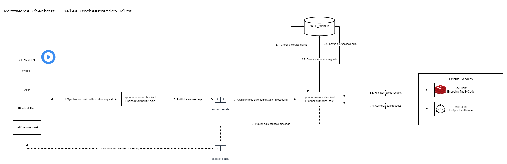
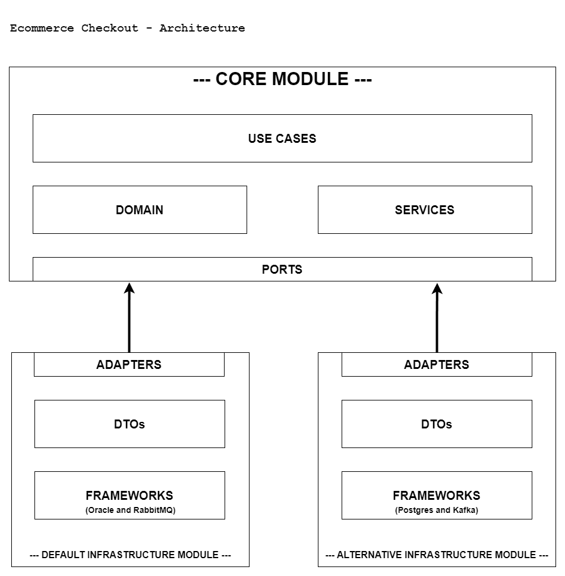

[](https://sonarcloud.io/summary/new_code?id=andersonlemos83_api-ecommerce-checkout)
[](https://sonarcloud.io/summary/new_code?id=andersonlemos83_api-ecommerce-checkout)
[](https://sonarcloud.io/summary/new_code?id=andersonlemos83_api-ecommerce-checkout)
[](https://sonarcloud.io/summary/new_code?id=andersonlemos83_api-ecommerce-checkout)
[](https://sonarcloud.io/summary/new_code?id=andersonlemos83_api-ecommerce-checkout)

This is the English version. For the Portuguese version, click [here](./README.pt.md).

# About the api-ecommerce-checkout project

This is a fictional project created exclusively for studying and validating new technologies.

## Technologies and Concepts

The main concepts and technologies I want to validate include:

- **Architecture**: Clean Architecture and Hexagonal Architecture
- **Acceptance Testing**: Cucumber, WireMock, and Testcontainers
- **Messaging and Asynchronous Processing**: RabbitMQ and Kafka
- **Caching and Fault Tolerance**: Redis and Resilience4j

## Bibliographic Inspiration

📖 *Clean Architecture: A Craftsman's Guide to Software Structure and Design* – Robert C. Martin  
📖 *Clean Agile: Back to Basics* – Robert C. Martin  
📖 *Clean Code: A Handbook of Agile Software Craftsmanship* – Robert C. Martin  
📖 *Growing Object-Oriented Software, Guided by Tests* – Steve Freeman  
📖 *Refactoring: Improving the Design of Existing Code* – Martin Fowler

🎓 *[Java Spring Microservices Specialist Training](https://e-certificado.com/login/visualizar?c=2343053A8150F7A015193380)* – Decoder Project

## Main Technologies and Tools Used

- **Language**: Java 21 LTS, Gherkin (for BDD with Cucumber)
- **Framework**: Spring Boot 3.1.4 (Web, Undertow, Validation, Data JPA, AMQP, Data Redis, Actuator, among others)
- **Messaging and Asynchronous Processing**: RabbitMQ and Kafka
- **Unit and Acceptance Testing**: JUnit 5, Mockito, Cucumber, WireMock, Testcontainers and Instancio
- **Database**: Oracle and PostgreSQL (with Hibernate and HikariCP)
- **Caching and Fault Tolerance**: Redis and Resilience4j
- **API Documentation**: Swagger/OpenAPI
- **Service Communication**: OpenFeign
- **Containerization**: Docker
- **Logging and Monitoring**: Log4j2 and Spring Boot Actuator
- **Dependency Management**: Maven
- **Version Control**: Git
- **Continuous Integration (CI)**: GitHub Actions
- **Code Quality**: SonarQube

## Domain

A fictional e-commerce conducts hundreds of thousands of sales through multiple channels, including website, app, physical store, and self-checkout.
To ensure correct taxation, authorization, and sales registration, an orchestrator system is essential.
This orchestrator will be responsible for compiling the tax matrix of cart items, validating payment methods,
authorizing sales with the MidClient service, notifying channels and customers about invoice issuance, and recording all transactions in the database.

## Features

## authorize-sale.feature
### Base Scenario - Authorize sale with all valid data provided
**Given** that all valid sales data has been provided  
**When** the sale is authorized via the `/authorize-sale`    
**Then** a message containing the sale data must be published in the queue (or topic) `authorize-sale`  
**And** a response must be returned indicating that processing is in progress

## process-sale-authorization.feature
### Base Scenario - Process sale authorization with all valid data provided
**Given** that all valid sales data has been provided  
**And** that the tax matrix data is available at the `/findByCode` of the TaxClient service    
**And** that invoice data is available at the `/authorize` endpoint of the MidClient service    
**When** the sale authorization is processed via the `authorize-sale` listener    
**Then** the system must authorize the sale with its tax matrix via the `/authorize` endpoint of the MidClient service  
**And** must record the sale in the database  
**And** must publish a message containing the processed sale data and its invoice in the queue (or topic) `sale-callback`  

## Sales Orchestration Flow



[View in full screen](./script/diagrams/sales-orchestration-flow.png)

## Architecture

The Ecommerce Checkout project was developed following the principles of clean and hexagonal architecture, aiming to isolate business rules in a Core module and allow the implementation of different infrastructures.

Currently, the following infrastructure modules have been implemented:

- **Default Infrastructure Module**: Uses Oracle as the database and RabbitMQ as the messaging system.
- **Alternative Infrastructure Module**: Uses PostgreSQL as the database and Kafka as the messaging system.



[View in full screen](./script/diagrams/architecture.png)

## Requirements

- Java JDK 21
- Maven 3.6.2 or higher
- Docker (Necessary for Testcontainer and to run the application locally)

## First Steps

- **Download all project dependencies**:
  ```
    mvn dependency:resolve -U
  ```
- **Build the project**: 
  ```
    mvn -U -B clean install -Dmaven.test.skip=true
  ```
- **Build the project and run all tests**: 
  ```
    mvn -U -B clean install
  ```

## About the Tests

To organize the tests according to their type and function, they were grouped into three main suites:

- **RunCucumberTest**: Contains all acceptance tests implemented with Cucumber and BDD. This suite has a slower execution, as it requires the initialization of the context and infrastructure.
- **UnitTests**: Contains all unit tests of the project. As it has no external dependencies, its execution is fast.
- **AllTests**: Groups all implemented tests, combining acceptance tests (RunCucumberTest) and unit tests (UnitTests).

## Getting Started with the Default Application (Oracle and RabbitMQ)

- **Wiremock**:
1. Start a Wiremock instance:
  ```
    docker-compose -f .\script\docker\wiremock.yml up -d
  ```

2. Test the Wiremock instance: [Test Wiremock](http://localhost:8443/findByCode?code=100231933559)
  ```
    curl 'http://localhost:8443/findByCode?code=100231933559'
  ```

- **Redis**:
1. Start a Redis instance:
  ```
    docker-compose -f .\script\docker\redis.yml up -d
  ```

2. Test the Redis instance:
  ```
    1. docker exec -it redis /bin/bash
    2. redis-cli
    3. KEYS "*"
    4. exit
    5. exit
  ```

- **RabbitMQ**:
1. Start a RabbitMQ instance:
  ```
    docker-compose -f .\script\docker\rabbitmq.yml up -d
  ```

2. Access the RabbitMQ instance:
   [Access RabbitMQ Admin](http://localhost:15672/)

3. Log in to RabbitMQ Admin with guest:
  ```
    username: guest
    password: guest
  ```

4. Create a new user ecommerce-checkout:
  ```
    1. Go to /Admin/User
    2. Fill in Username: ecommerce-checkout, Password: ecommerce-checkout e Tags: administrator
    3. Click "Add user" 
  ```

5. Create a new virtual host ecommerce-checkout:
  ```
    1. Go to /Admin/Virtual Hosts
    2. Fill in Name: ecommerce-checkout e Default Queue Type: Classic
    3. Click "Add virtual host" 
  ```

6. Add permissions for the ecommerce-checkout user to the ecommerce-checkout virtual host:
  ```
    1. Go to /Admin/Virtual Hosts/ecommerce-checkout
    2. Fill in User: ecommerce-checkout, Configure regexp: .*, Write regexp: .* e Read regexp: .*
    3. Click "Set permissions" 
  ```

7. Log in to RabbitMQ Admin with ecommerce-checkout:
  ```
    username: ecommerce-checkout
    password: ecommerce-checkout
  ```

8. Create a new queue sale-callback-queue:
  ```
    1. Go to /Queues and Streams
    2. Fill in Virtual host: ecommerce-checkout, Type: Default fo virtual host, Name: sale-callback-queue e Durability: Durable
    3. Click "Add queue" 
  ```

- **Oracle**:
1. Start an Oracle instance:
  ```
    docker-compose -f .\script\docker\oracledb-12c-ee.yml up -d
  ```

2. Test the instance through some Oracle client (I recommend DBeaver or SQL Developer):
  ```
  host: localhost
  port: 1521
  service name: ORCL
  username: SYSTEM
  password: oracle

  jdbc:oracle:thin:@//localhost:1521/ORCL

  OBS: Sometimes the Oracle instance takes a while to start!
  ```

3. Create objects for the ECOMMERCE_CHECKOUT_OWNER schema:
[oracle.sql](./script/db/oracle.sql)

- **Default Application (Oracle and RabbitMQ)**:
1. Create and run a Spring Boot runner:
  ```
    Main Class: /infrastructure/src/main/java/br/com/alc/ecommerce/checkout/infrastructure/EcommerceCheckoutInfrastructureApplication.java
    Profile: local (application-local.yml)
  ```

2. Access Swagger UI:
   [Access Swagger UI](http://localhost:8181/swagger-ui.html)

3. Import Postman Collection:
   [api-ecommerce-checkout.postman_collection.json](./script/postman/api-ecommerce-checkout.postman_collection.json)

4. Test application:
  ```
  1. Send a POST request to http://localhost:8181/authorize-sale (Swagger or Postman!);
  2. Verify if there is a PROCESSED record in the ECOMMERCE_CHECKOUT_OWNER.SALE_ORDER table;
  3. Verify if there is a message in the sale-callback-queue queue.
  ```

## Getting Started with the Alternative Application (PostgreSQL and Kafka)

- **Wiremock**:
1. Start a Wiremock instance:
  ```
    docker-compose -f .\script\docker\wiremock.yml up -d
  ```

2. Test the Wiremock instance: [Test Wiremock](http://localhost:8443/findByCode?code=100231933559)
  ```
    curl 'http://localhost:8443/findByCode?code=100231933559'
  ```

- **Redis**:
1. Start a Redis instance:
  ```
    docker-compose -f .\script\docker\redis.yml up -d
  ```

2. Test the Redis instance:
  ```
    1. docker exec -it redis /bin/bash
    2. redis-cli
    3. KEYS "*"
    4. exit
    5. exit
  ```

- **Kafka**:
1. Start a Kafka instance:
  ```
    docker-compose -f .\script\docker\kafka.yml up -d
  ```

2. Access the Kafka instance:
   [Access Kafka Admin](http://localhost:8787/)

3. Create a new topic named sale-callback-topic:
  ```
    1. Go to /Topics
    2. Click "Add a Topic"
    2. Fill in Topic Name: sale-callback-topic, Number of Partitions: 2 e Cleanup policy: Delete
    3. Click "Create topic" 
  ```

- **PostgreSQL**:
1. Start a PostgreSQL instance:
  ```
    docker-compose -f .\script\docker\postgresdb.yml up -d
  ```

2. Test the instance using a PostgreSQL client (I recommend DBeaver or PGAdmin):
  ```
  host: localhost
  port: 5432
  database: postgres
  username: postgres
  password: postgres

  jdbc:postgresql://localhost:5432/postgres
  ```

3. Create the ecommerce_db database objects:
   [postgres.sql](./script/db/postgres.sql)

- **Alternative Application (PostgreSQL e Kafka)**:
1. Create and run a Spring Boot runner:
  ```
    Main Class: /alternative-infrastructure/src/main/java/br/com/alc/ecommerce/checkout/infrastructure/EcommerceCheckoutAlternativeInfrastructureApplication.java
    Profile: local (application-local.yml)
  ```

2. Access Swagger UI:
   [Access Swagger UI](http://localhost:8282/swagger-ui.html)

3. Import Postman Collection:
   [api-ecommerce-checkout.postman_collection.json](./script/postman/api-ecommerce-checkout.postman_collection.json)

4. Test application:
  ```
  1. Enviar um request POST para http://localhost:8282/authorize-sale (Swagger ou Postman!);
  2. Verify if there is a PROCESSED record in the PUBLIC.SALE_ORDER table;
  3. Verify if there is a message in the sale-callback-topic.
  ```

## That's all folks!

I hope you enjoyed it.